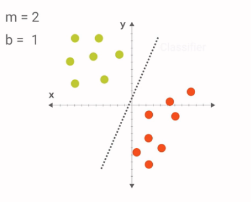

# Let’s Write a Pipeline
> 转载请注明作者：[梦里风林](https://github.com/ahangchen)

> Google Machine Learning Recipes 4

> [官方中文博客](http://chinagdg.org/2016/03/machine-learning-recipes-for-new-developers) - [视频地址](http://v.youku.com/v_show/id_XMTU2Njk0Njc3Ng==.html?f=26979872&from=y1.7-3)

> Github工程地址 https://github.com/ahangchen/GoogleML

> 欢迎Star，也欢迎到[Issue区讨论](https://github.com/ahangchen/GoogleML/issues)

复习与强化概念

- 监督学习基础套路
  - 例子： 一个用于举报邮件的分类器
 
  > 关键在于举报新的邮件
  
  - Train vs Test：隔离训练集，测试集以验证训练效果 
  - f(x) = y
  > feature: x, label: y, classifier其实就是一个feature到label的函数
  - 可以从sklearn中import各种分类器进行训练，各种分类器有类似的接口

  > 这些不同分类器都可以解决类似的问题

- 让算法从数据中学习到底是什么
  - 拒绝手工写分类规则代码
  - 本质上，是学习feature到label，从输入到输出的函数
  - 从一个模型开始，用规则来定义函数
  - 根据训练数据调整函数参数
  - 从我们发现规律的方法中，找到model
  - 比如一条划分两类点的线就是一个分类器的model，调整参数就能得到我们想要的分类器：
  
  - [TensorFlow PlayGround](http://playground.tensorflow.org/#activation=tanh&batchSize=10&dataset=circle&regDataset=reg-plane&learningRate=0.03&regularizationRate=0&noise=0&networkShape=4,2&seed=0.61429&showTestData=false&discretize=false&percTrainData=50&x=true&y=true&xTimesY=false&xSquared=false&ySquared=false&cosX=false&sinX=false&cosY=false&sinY=false&collectStats=false&problem=classification)
 
  > Example of Neural Network
  
- [sklearn 笔记](https://github.com/ahangchen/GDLnotes/tree/master/note/sklearn)

> 觉得我的文章对您有帮助的话，就给个[star](https://github.com/ahangchen/GDLnotes)吧～
