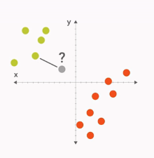
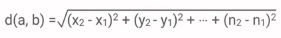

# Writing Our First Classifier
> 转载请注明作者：[梦里风林](https://github.com/ahangchen)

> Google Machine Learning Recipes 5

> [官方中文博客](http://chinagdg.org/2016/03/machine-learning-recipes-for-new-developers) - [视频地址](http://v.youku.com/v_show/id_XMTU2Njk0Njc3Ng==.html?f=26979872&from=y1.7-3)

> Github工程地址 https://github.com/ahangchen/GoogleML

> 欢迎Star，也欢迎到[Issue区讨论](https://github.com/ahangchen/GoogleML/issues)

- 从底层实现一个分类器

## 目标
实现一个K近邻（k-Nearest Neighbour）问题

## K Nearest Neighbour

- 对于一个测试点，看它最近的邻居属于那个类别
- 考虑最近邻居的时候，我们可以综合考虑与这个点距离最近的K个点，看它们中有多少输入类别A，多少属于类别B
- 距离：两点间的直线距离（Euclidean Distance）

- 即考虑各个feature之间差异的平方和

## 实现
- 在Lesson4的基础上进行，我们在lesson4中使用了KNeighborsClassifier()作为分类器，现在我们要实现这个分类器
- ScrappyKNN：最简单的一个K近邻分类器
  - 接口：
    - fit：用于训练，将训练集的feature和label作为输入
    - predict: prediction，将测试集的feature作为输入，输出预测的label
  - Random Classifier
    - 随机挑一个label作为预测输出，由于我们是在三种花的结果中随机挑取一种花作为结果，所以结果大概在33%
- KNN:
  - 设置k=1，也就是我们只考虑最近的那个点属于那个类别
  - 用scipy.spatial.distance来计算距离
  - 返回测试点最近邻的label
  
## 结论
- 准确率：90%以上（这里也可能看出feature选得好的重要性）
- 优点：非常简单
- 缺点：耗时；不能表示复杂的东西；