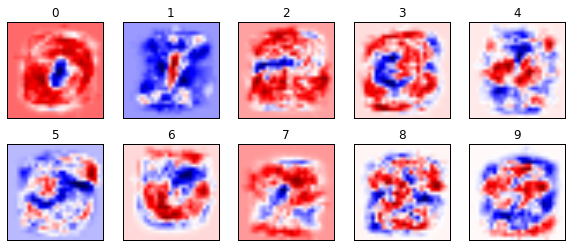

# Google机器学习笔记（七）TF.Learn 手写文字识别

> 转载请注明作者：[梦里风林](https://github.com/ahangchen)

> Google Machine Learning Recipes 7

> [官方中文博客](http://chinagdg.org/2016/03/machine-learning-recipes-for-new-developers) - [视频地址](http://v.youku.com/v_show/id_XMTY4NzkxMzQ4MA==.html?f=26979872&from=y1.2-3.4.8)

> Github工程地址 https://github.com/ahangchen/GoogleML

> 欢迎Star，也欢迎到[Issue区讨论](https://github.com/ahangchen/GoogleML/issues)

## mnist问题
- 计算机视觉领域的Hello world
- 给定55000个图片，处理成28*28的二维矩阵，矩阵中每个值表示一个像素点的灰度，作为feature
- 给定每张图片对应的字符，作为label，总共有10个label，是一个多分类问题

## TensorFlow
- 可以按教程用Docker安装，也可以直接在Linux上安装
- 你可能会担心，不用Docker的话怎么开那个notebook呢？其实notebook就在主讲人的[Github页](https://github.com/random-forests/tutorials)上
- 可以用这个Chrome插件:[npviewer](https://chrome.google.com/webstore/detail/open-in-nbviewer/ihlhlehlibooakiicbiakgojckpnlali?hl=zh-CN)直接在浏览器中阅读ipynb格式的文件，而不用在本地启动iPython notebook
- 我们的教程在这里：[ep7.ipynb](https://github.com/random-forests/tutorials/blob/master/ep7.ipynb)
- 把代码从ipython notebook中整理出来：[tflearn_mnist.py](../src/tflearn_mnist.py)


## 代码分析
- 下载数据集

```python
mnist = learn.datasets.load_dataset('mnist')
```

恩，就是这么简单，一行代码下载解压mnist数据，每个img已经灰度化成长784的数组，每个label已经one-hot成长度10的数组

> 在我的[深度学习笔记](https://github.com/ahangchen/GDLnotes/blob/master/note/lesson-1/logistic_classify.md#one-hot-encoding)看One-hot是什么东西

- numpy读取图像到内存，用于后续操作，包括训练集（只取前10000个）和验证集

```python
data = mnist.train.images
labels = np.asarray(mnist.train.labels, dtype=np.int32)
test_data = mnist.test.images
test_labels = np.asarray(mnist.test.labels, dtype=np.int32)
max_examples = 10000
data = data[:max_examples]
labels = labels[:max_examples]
```

- 可视化图像

```python
def display(i):
    img = test_data[i]
    plt.title('Example %d. Label: %d' % (i, test_labels[i]))
    plt.imshow(img.reshape((28, 28)), cmap=plt.cm.gray_r)
    plt.show()
```

> 用matplotlib展示灰度图

- 训练分类器
  - 提取特征（这里每个图的特征就是784个像素值）

```python
feature_columns = learn.infer_real_valued_columns_from_input(data)
```

  - 创建线性分类器并训练

```python
classifier = learn.LinearClassifier(feature_columns=feature_columns, n_classes=10)
classifier.fit(data, labels, batch_size=100, steps=1000)
```

> 注意要制定n_classes为labels的数量

  - 分类器实际上是在根据每个feature判断每个label的可能性，
  - 不同的feature有的重要，有的不重要，所以需要设置不同的权重
  - 一开始权重都是随机的，在fit的过程中，实际上就是在调整权重
  
  
  
  - 最后可能性最高的label就会作为预测输出
   
- 传入测试集，预测，评估分类效果

```python
result = classifier.evaluate(test_data, test_labels)
print result["accuracy"]
```

> 速度非常快，而且准确率达到91.4%

可以只预测某张图，并查看预测是否跟实际图形一致

```python
# here's one it gets right
print ("Predicted %d, Label: %d" % (classifier.predict(test_data[0]), test_labels[0]))
display(0)
# and one it gets wrong
print ("Predicted %d, Label: %d" % (classifier.predict(test_data[8]), test_labels[8]))
display(8)
```

- 可视化权重以了解分类器的工作原理

```python
weights = classifier.weights_
a.imshow(weights.T[i].reshape(28, 28), cmap=plt.cm.seismic)
```



  - 这里展示了8个张图中，每个像素点（也就是feature）的weights，
  - 红色表示正的权重，蓝色表示负的权重
  - 作用越大的像素，它的颜色越深，也就是权重越大
  - 所以权重中红色部分几乎展示了正确的数字
  
## Next steps
- [TensorFlow Docker images](https://hub.docker.com/r/tensorflow/tensorflow/)
- [TF.Learn Quickstart](https://www.tensorflow.org/versions/r0.9/tutorials/tflearn/index.html)
- [MNIST tutorial](https://www.tensorflow.org/tutorials/mnist/beginners/index.html)
- [Visualizating MNIST](http://colah.github.io/posts/2014-10-Visualizing-MNIST/)
- [Additional notebooks](https://github.com/tensorflow/tensorflow/tree/master/tensorflow/tools/docker/notebooks)
- [More about linear classifiers](https://www.tensorflow.org/versions/r0.10/tutorials/linear/overview.html#large-scale-linear-models-with-tensorflow)
- [Much more about linear classifiers](http://cs231n.github.io/linear-classify/)
- [Additional TF.Learn samples](https://github.com/tensorflow/tensorflow/tree/master/tensorflow/examples/skflow)